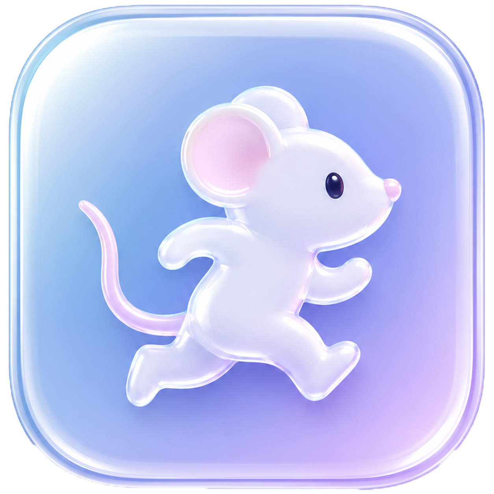
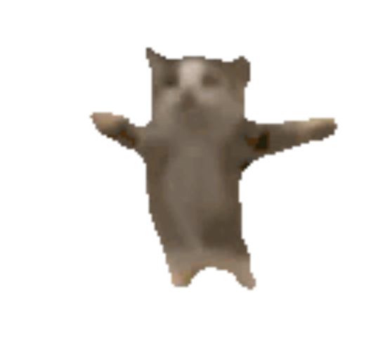
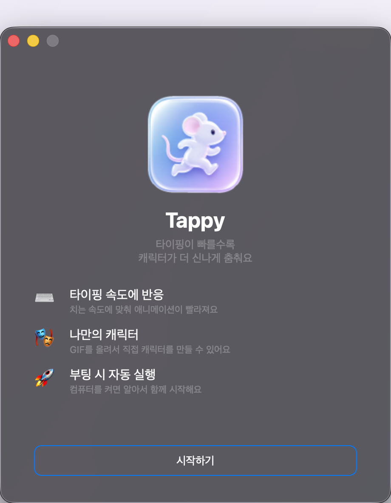
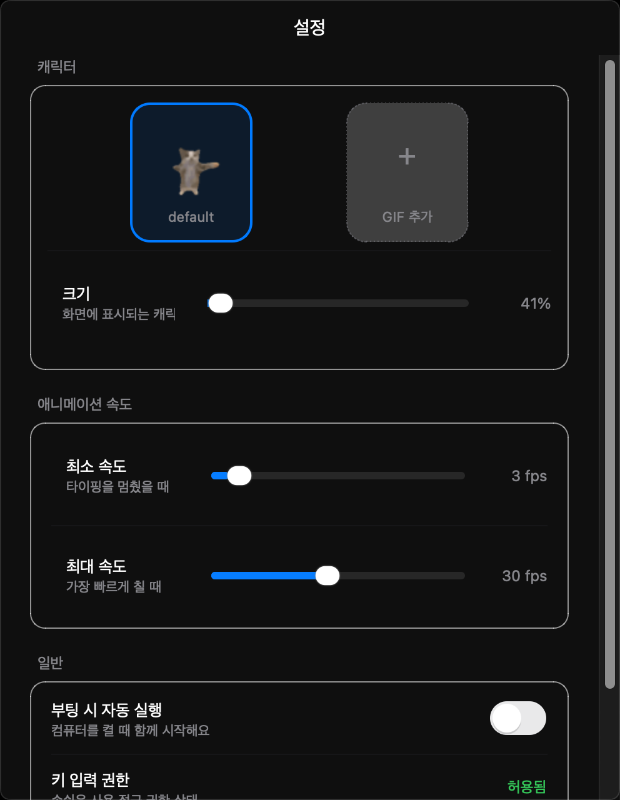
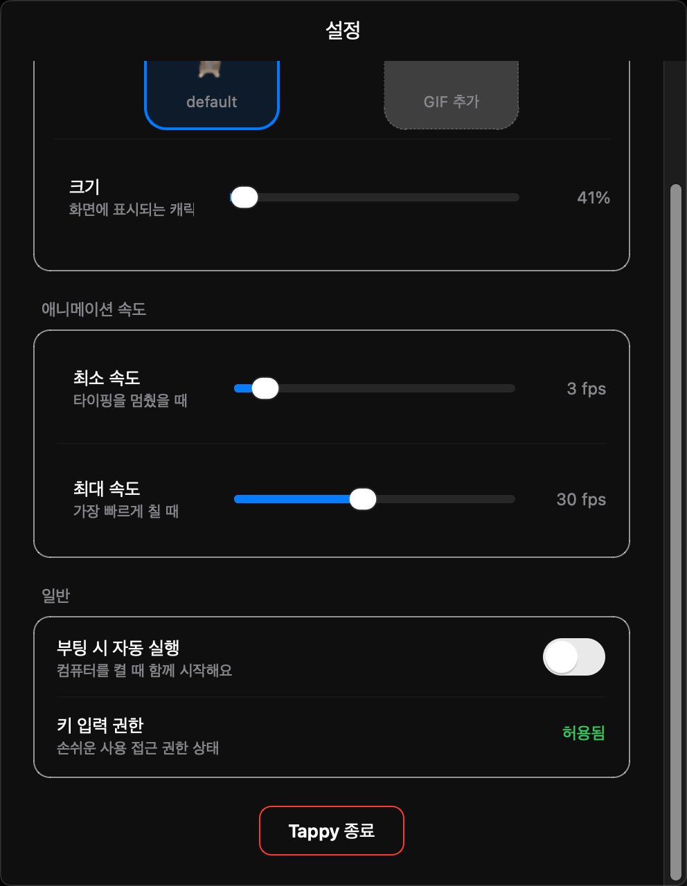

<div align="center">



# Tappy

### 타이핑이 빠를수록 더 신나게 춤추는 데스크톱 펫

모든 창 위에 작은 캐릭터가 앉아, 당신이 키보드를 두드리는 속도에 맞춰
애니메이션이 빨라집니다. 타이핑을 멈춰도 — 천천히, 계속 춤춰요.

<br/>


</div>

---

## 🐾 만나보기

<div align="center">



<br/>

**프레임 없는 투명 창** — 항상 모든 창의 맨 위에 떠 있어요.
드래그해서 원하는 곳에 두고, 스크롤로 크기를 조절하고,
오른쪽 클릭으로 설정을 엽니다.

</div>

---

## 📸 화면

### 환영 화면

처음 실행할 때 한 번 보이는 화면입니다. 로고와 기능 소개가
하나씩 부드럽게 떠오르는 등장 애니메이션과 함께 나타나요.

<div align="center">

</div>

<br/>

### 설정 — 캐릭터 & 속도

캐릭터를 고르거나 직접 만든 GIF를 올리고, 화면에 표시되는 크기와
애니메이션 속도 범위를 조절합니다.

<div align="center">

</div>

<br/>

### 설정 — 일반

부팅 시 자동 실행을 켜고, macOS 손쉬운 사용(키 입력) 권한 상태를
확인합니다.

<div align="center">

</div>

---

## ✨ 기능

| | |
|---|---|
| ⌨️ **타이핑 속도에 반응** | 치는 속도에 맞춰 애니메이션이 빨라지고, 멈추면 천천히 춤춰요 |
| 🎭 **나만의 캐릭터** | GIF·PNG·WebP를 올려 직접 캐릭터를 만들 수 있어요 |
| 🚀 **부팅 시 자동 실행** | 컴퓨터를 켜면 알아서 함께 시작해요 |
| 🪟 **네이티브 창** | macOS는 Tahoe 리퀴드 글래스, Windows는 11 Mica 배경 |
| 🖱️ **자유로운 배치** | 드래그로 이동, 스크롤로 크기 조절 — 위치는 저장돼요 |
| 🍱 **시스템 트레이** | 트레이 아이콘에서 바로 설정을 열 수 있어요 |

---

## ⚙️ 동작 원리

```
키 입력  ──>  pynput 리스너 (백그라운드 스레드)
                  │  타임스탬프만 deque에 쌓음
                  ▼
            80ms 폴링 타이머 (Qt 메인 스레드)
                  │  최근 입력 속도 계산
                  ▼
            SpeedModel  ──>  부드럽게 보정된 FPS
                  │
                  ▼
            PetWindow  ──>  그만큼 빠르게 프레임 재생
```

타이핑을 멈추면 FPS가 `min_fps`까지 서서히 줄어들어, 캐릭터가
멈추지 않고 천천히 계속 움직입니다.

---

## 🚀 실행하기

```bash
pip install -r requirements.txt
python main.py
```

Python 3.11 이상이 필요합니다 (3.14에서 개발). macOS·Windows에서 동작해요.

> **macOS**: 전역 키 입력 감지는 손쉬운 사용 권한이 필요합니다.
> **시스템 설정 → 개인정보 보호 및 보안 → 손쉬운 사용**에서 허용한 뒤
> 앱을 다시 실행하세요. 권한이 없어도 캐릭터는 동작하지만 타이핑에는
> 반응하지 않습니다.

자세한 빌드·배포 방법은 [README.md](README.md)를 참고하세요.

---

<div align="center">

<sub>스크린샷은 macOS에서 캡처되었습니다. 캐릭터는 기본 제공 <code>default</code> 캐릭터입니다.</sub>

</div>
